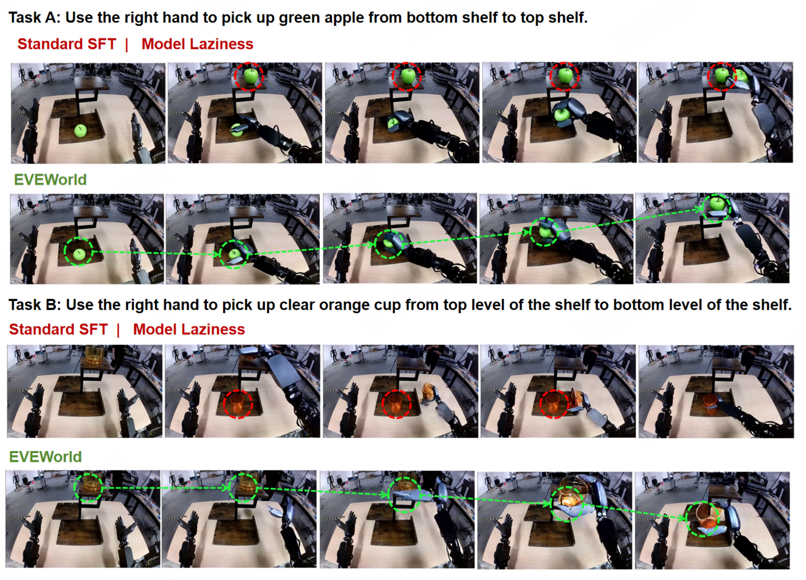

# EVEWorld: Evolution-Supervised Process-Faithful World Model for Embodied AI

Official code release for the paper **"EVEWorld: Evolution-Supervised Process-Faithful World Model for Embodied AI"** (under review).



## Overview

Video world models can generate plausible robot-interaction rollouts, yet the manipulated target may **duplicate, disappear, or change discontinuously** during an otherwise coherent action sequence. We call this process-level failure **Model Laziness** and measure it with the **Model Laziness Rate (MLR)**, a deterministic detector-based metric that flags persistent target-count violations.

**EVEWorld** supervises target-instance evolution with two complementary components:

- **Instance-Guided Restoration (IGR)** — trains the model to restore clean videos from duplicate-corrupted inputs, with spatially up-weighted reconstruction over the corrupted region.
- **Temporal Instance Alignment (TIA)** — enforces local cross-frame correspondence of the target at a probed Transformer layer via feature transport and a contrastive correspondence loss.

On DreamGenBench, EVEWorld reduces MLR from 10.94% to 1.59% relative to Standard SFT while improving both instruction-following metrics. Transfer is validated on WorldArena 1.0 (zero-shot domains), EWMBench (AgiBot training distribution), and RoboTwin (FlowWAM backbone).

## Main Results (DreamGenBench)

| Method | MLR (%) ↓ | Qwen-IF (%) ↑ | Gemini-IF (%) ↑ |
|---|---|---|---|
| CogVideoX1.5-5B-I2V | 28.57 | 38.89 | 5.56 |
| Wan2.2-TI2V-5B | 18.03 | 38.89 | 10.32 |
| Wan2.2-I2V-A14B | 11.11 | 64.29 | 15.87 |
| Cosmos-Predict2-2B | 15.00 | 62.70 | 24.60 |
| GigaWorld-0 | 13.33 | 79.37 | 60.19 |
| Standard SFT | 10.94 | 73.81 | 53.57 |
| **EVEWorld (ours)** | **1.59** | **80.16** | **60.85** |

## Repository Layout

| Directory | Contents |
|---|---|
| [`eveworld/`](eveworld/) | **Method core**: IGR corruption & restoration, TIA correspondence, training, MLR metric, evaluation tooling, and the five alternative designs analyzed in the paper |
| [`giga-world-0/`](giga-world-0/) | Pinned snapshot of the [GigaWorld-0](https://github.com/open-gigaai/giga-world-0) backbone (model package, configs, training/inference scripts) |
| [`giga-models/`](giga-models/) | Pinned snapshot of the [GigaModels](https://github.com/open-gigaai/giga-models) framework (training infrastructure used by the backbone) |
| [`benchmarks/`](benchmarks/) | Evaluation pipelines: DreamGenBench, WorldArena 1.0, EWMBench (AgiBot), RoboTwin-FlowWAM, PBench, and cross-model baselines |
| [`docs/`](docs/) | Environment setup, data preparation, and end-to-end reproduction guides |
| [`paper/`](paper/) | Paper source (LaTeX) |
| [`assets/`](assets/) | Images used by this README |

> **Note on vendored code.** `giga-world-0/` and `giga-models/` are plain-directory snapshots (not git submodules), pinned to the exact versions used in our experiments so the release is self-contained. The FlowWAM backbone used for the cross-backbone experiment is referenced externally; see [`benchmarks/robotwin_flowwam/`](benchmarks/robotwin_flowwam/).

## Installation

```bash
conda create -n eveworld python=3.11.10 -y
conda activate eveworld
pip install -e ./giga-models
# plus the evaluation/training dependencies documented in docs/ENVIRONMENT.md
```

See [`docs/ENVIRONMENT.md`](docs/ENVIRONMENT.md) for the full dependency list, CUDA notes, and the reference environment export.

## Quick Start

1. **Prepare data & checkpoints** — see [`docs/DATASETS.md`](docs/DATASETS.md).
2. **Train EVEWorld (IGR + TIA)** — see [`eveworld/training/`](eveworld/training/).
3. **Generate & evaluate** — per-benchmark guides under [`benchmarks/`](benchmarks/).
4. **End-to-end reproduction** — [`docs/REPRODUCTION.md`](docs/REPRODUCTION.md).

## Paper

The paper source lives in [`paper/`](paper/). A preprint link will be added upon publication.

## License

This project is licensed under the Apache License 2.0 — see [LICENSE](LICENSE). Vendored snapshots retain their original licenses.
