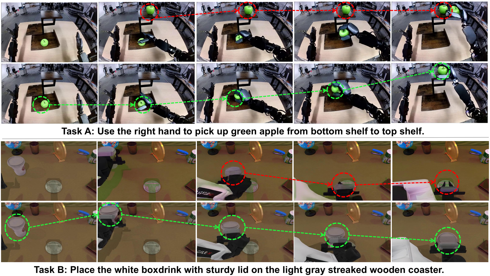

# EVEWorld

EVEWorld is the code release accompanying the paper *EVEWorld: Physical
Evolution Supervision for Embodied World Models*. Video world models can
generate a plausible robot-interaction rollout while the manipulated target
still duplicates, disappears, or jumps between frames: the model copies the
conditioning frame instead of synthesising the instructed interaction, and it
loses instance identity across frames. EVEWorld supervises target-instance
evolution with two complementary components. **Instance-Guided Restoration
(IGR)** trains the model to restore clean videos from duplicate-corrupted
inputs, with extra reconstruction weight on the disturbed interaction region.
**Temporal Instance Alignment (TIA)** enforces local cross-frame correspondence
of the target at a probed Transformer layer through feature transport and a
contrastive correspondence loss.



## Highlights

- DreamGenBench (GigaWorld-0 backbone): **1.59%** MLR, **80.16%** Qwen-IF,
  **60.85%** Gemini-IF.
- RoboTwin (FlowWAM backbone): **12.765 dB** PSNR, **0.769** SSIM, **0.365**
  LPIPS, **2.207** Flow-EPE, **35.21%** MLR.
- WorldArena 1.0 (zero-shot domains): **56.76** Overall, **13.38%** MLR.

## Backbone dependencies

This repository does **not** vendor the upstream backbones. The GigaWorld-0
backbone (including GigaModels) is maintained by its authors at
<https://github.com/open-gigaai/giga-world-0>; clone it into
`third_party/giga-world-0` before training or generating:

```bash
bash scripts/setup/clone_gigaworld.sh
```

The FlowWAM backbone is cloned into `third_party/FlowWAM` by
`bash scripts/setup/clone_flowwam.sh`. Both scripts accept a destination
argument and a `--ref` override, and both directories are gitignored, so an
existing checkout can be placed there instead. The two third-party trees and
their weights are never redistributed here. See
[`docs/third_party.md`](docs/third_party.md) and
[`third_party/README.md`](third_party/README.md).

## Installation

Three conda environments cover the release: `gigaworld` (GigaWorld-0 training
and generation), `flowwam` (FlowWAM / RoboTwin) and `eveworld-eval` (metrics,
judges and the benchmark harnesses).

```bash
conda env create -f envs/gigaworld.yaml && conda activate gigaworld
bash scripts/setup/clone_gigaworld.sh
pip install -e ".[train,eval]"
python scripts/setup/check_environment.py
```

[`docs/installation.md`](docs/installation.md) lists the per-environment
commands, the extras pulled in by `pip install -e ".[train,eval]"`, the
`.env.example` variables and the reference GPU setup.

## Repository layout

```
EVEWorld/
├── README.md  CONTRIBUTING.md  LICENSE  CITATION.cff  pyproject.toml  .env.example
├── assets/        figures, qualitative panels and the project-page media
├── docs/          installation, data, training, inference, evaluation, reproduction, checkpoints
├── envs/          conda environment files for the three supported environments
├── configs/       run configurations for training, evaluation and the ablations
├── src/eveworld/  the library: data tooling, IGR/TIA methods, integrations, evaluation
├── scripts/       setup, prepare, train, inference, evaluate and reproduce entry points
├── experiments/   alternative supervision designs and the analyses behind the paper figures
├── data/          splits, metadata and prompt files; the datasets themselves stay outside the repo
├── results/       released per-item scores and the aggregated paper tables
├── checkpoints/   download instructions; the weights themselves are gitignored
├── outputs/       scratch space for runs, fully gitignored
├── tests/         unit tests for the IGR, TIA and MLR components
├── third_party/   clone instructions for the two backbones, both gitignored
└── index.html  css/  js/   static project page
```

## Method overview

IGR turns each clean training clip into a count-edited supervision pair: a
duplicate of the tracked target is pasted into a sampled interaction region (or
the target is relocated), and the model is trained to reconstruct the clean
latent with three times the weight on the disturbed region. TIA reads the
target's hidden states at one probed Transformer layer and aligns them
across frames with a transport-based adapter, so the target keeps its
identity over the rollout. The two terms are optimised jointly as
`L = L_IGR + lambda_TIA * L_TIA`.


Recipes, block selection, warm-up schedules and the training commands are in
[`docs/training.md`](docs/training.md).

## Results

DreamGenBench, GigaWorld-0 backbone. The general models are evaluated
zero-shot; MLR is computed on the shared eligible set `U_63`.

| Method | MLR (%) ↓ | Qwen-IF (%) ↑ | Gemini-IF (%) ↑ |
|---|---|---|---|
| CogVideoX1.5-5B-I2V | 28.57 | 38.89 | 5.56 |
| Wan2.2-TI2V-5B | 17.46 | 38.89 | 10.32 |
| Wan2.2-I2V-A14B | 11.11 | 64.29 | 15.87 |
| Cosmos-Predict2-2B | 14.29 | 62.70 | 24.60 |
| GigaWorld-0 | 12.70 | 79.37 | 60.19 |
| Standard SFT | 11.11 | 73.81 | 53.57 |
| **EVEWorld** | **1.59** | **80.16** | **60.85** |

RoboTwin, FlowWAM backbone, 250 held-out episodes.

| Variant | IGR | TIA | PSNR (dB) ↑ | SSIM ↑ | LPIPS ↓ | Flow-EPE ↓ | MLR (%) ↓ |
|---|---|---|---|---|---|---|---|
| FlowWAM | | | 12.218 | 0.748 | 0.383 | 3.033 | 52.05 |
| Standard SFT | | | 11.687 | 0.735 | 0.414 | 2.828 | 47.89 |
| + IGR | ✓ | | 12.544 | 0.770 | 0.380 | 2.487 | 40.03 |
| + TIA | | ✓ | 13.445 | 0.776 | 0.333 | 1.850 | 22.54 |
| **EVEWorld** | ✓ | ✓ | **12.765** | **0.769** | **0.365** | **2.207** | **35.21** |

Component ablation on DreamGenBench: Gemini-IF breakdown and MLR.

| Variant | Env ↑ | Object ↑ | Behavior ↑ | Overall ↑ | MLR (%) ↓ |
|---|---|---|---|---|---|
| Standard SFT | 51.72 | 42.00 | 67.02 | 53.57 | 11.11 |
| IGR only | 49.43 | 36.67 | 69.50 | 51.85 | 4.76 |
| TIA only | 55.17 | 42.67 | 68.79 | 55.29 | 7.94 |
| **EVEWorld** | **72.41** | **50.33** | 64.89 | **60.85** | **1.59** |

The WorldArena 1.0 and EWMBench transfer numbers are listed in
[`docs/evaluation.md`](docs/evaluation.md).

## Data and checkpoints

Dataset splits and per-clip metadata are prepared into `data/splits/` and
`data/metadata/`; the datasets themselves are downloaded from their upstream
projects and never committed. Released weights are fetched with
`bash scripts/setup/download_models.sh`, which honours
`EVEWORLD_CHECKPOINT_ROOT`.

- [`docs/data_preparation.md`](docs/data_preparation.md) — datasets, splits,
  annotation schema and the `scripts/prepare/*` commands.
- [`docs/checkpoints.md`](docs/checkpoints.md) — what each paper row uses and
  where the downloads land.

## Reproduction

Each paper artefact has one script; every script takes the published settings
and writes into `results/`.

```bash
bash scripts/reproduce/table1_dreamgen.sh    # Table 1, DreamGenBench
bash scripts/reproduce/table3_worldarena.sh  # Table 3, WorldArena 1.0
bash scripts/reproduce/table4_ewmbench.sh    # Table 4, EWMBench (AgiBot)
bash scripts/reproduce/table5_robotwin.sh    # Table 5, RoboTwin (FlowWAM)
bash scripts/reproduce/table6_ablation.sh    # Table 6, component ablation
bash scripts/reproduce/figure4_cfg.sh        # Figure 4, CFG sensitivity
```

[`docs/reproduction.md`](docs/reproduction.md) documents the inputs, compute
and expected numbers behind each of them.

## Citation

The citable metadata lives in [`CITATION.cff`](CITATION.cff). Until the review
process concludes, the author list stays anonymous:

```bibtex
@software{eveworld,
  title  = "{EVEWorld}: Physical Evolution Supervision for Embodied World Models",
  author = "{Anonymous Author(s)}",
  url    = "{https://behappya.github.io/EVEWorld/}",
  note   = "See CITATION.cff for the machine-readable entry."
}
```

## License

The repository is licensed under the Apache License 2.0 — see
[`LICENSE`](LICENSE). Third-party components keep their own licences:
GroundingDINO, SAM2, RAFT, LPIPS, WorldArena, DreamGenBench, EWMBench, PBench,
FlowWAM and GigaWorld-0. No upstream code or weights are redistributed here;
see [`docs/third_party.md`](docs/third_party.md) and
[`third_party/README.md`](third_party/README.md).

Contributions are welcome — see [`CONTRIBUTING.md`](CONTRIBUTING.md).
