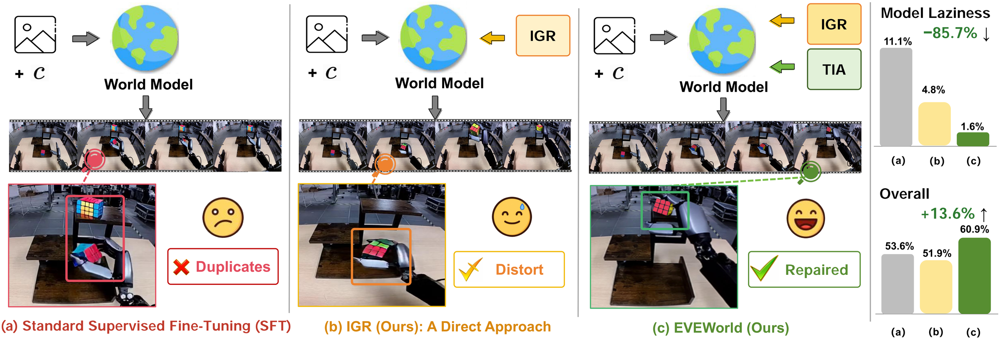
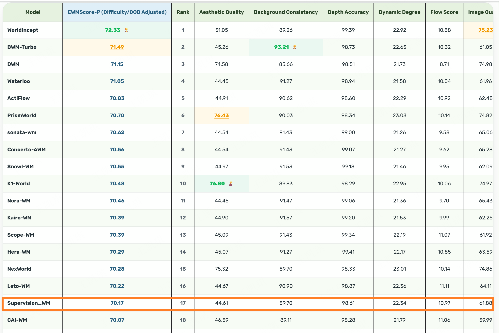
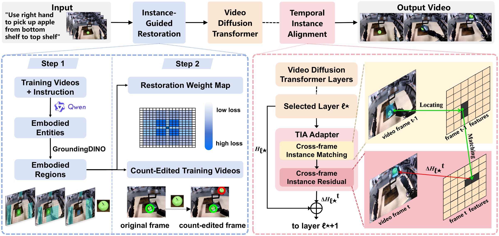

<h1 align="center">EVEWorld</h1>
<p align="center"><strong>Physical Evolution Supervision for Embodied World Models</strong></p>

<p align="center">
  <a href="https://behappya.github.io/EVEWorld/">Project Page</a> ·
  <a href="#quick-start">Quick Start</a> ·
  <a href="#reproducing-the-paper">Reproduction</a> ·
  <a href="#citation">BibTeX</a>
</p>

<p align="center">
  <a href="https://behappya.github.io/EVEWorld/"></a>
  <a href="LICENSE"></a>
  <a href="docs/installation.md"></a>
  <a href="https://github.com/behappya/EVEWorld/actions/workflows/tests.yml"></a>
</p>

<p align="center">
  
</p>

<p align="center"><em>EVEWorld combines restoration supervision for target-instance consistency with temporal alignment for cross-frame consistency.</em></p>

## Overview

Visual plausibility does not guarantee physically consistent target evolution. In embodied video world models, the manipulated target may be spuriously duplicated or disappear during a rollout, while count-preserving deformation or identity drift can still occur across adjacent frames.

**EVEWorld** introduces two complementary forms of evolution supervision: **Instance-Guided Restoration (IGR)** restores clean demonstrations from count-perturbed inputs to promote target-instance consistency, while **Temporal Instance Alignment (TIA)** aligns target representations across adjacent frames to promote cross-frame consistency. We further introduce **Model Laziness Rate (MLR)**, a rollout-level, occlusion-aware and persistence-aware diagnostic for persistent target-instance violations.

Quantitative and qualitative results are available on the [project page](https://behappya.github.io/EVEWorld/) and in the paper.

## 🏆 WorldArena 2.0 Leaderboard

Our FlowWAM-based EVEWorld submission, **Supervision_WM**, achieves an
**EWMScore-P of 70.17** on **WorldArena 2.0 Track 1 — Simulator Video Quality**,
ranking **6th in JEPA Similarity** and **17th overall**.

<p align="center">
  <a href="https://huggingface.co/spaces/WorldArena/WorldArena2.0">
    
  </a>
</p>

<p align="center">
  <strong>70.17 EWMScore-P</strong>
  &nbsp;·&nbsp;
  <strong>6th in JEPA Similarity</strong>
  &nbsp;·&nbsp;
  <strong>17th overall</strong>
</p>

<p align="center">
  <a href="https://huggingface.co/spaces/WorldArena/WorldArena2.0">
    <strong>View the official WorldArena 2.0 leaderboard ↗</strong>
  </a>
</p>

## What is released

- [x] IGR training pipeline
- [x] TIA alignment module
- [x] MLR evaluation protocol
- [x] DreamGen / WorldArena / EWMBench / RoboTwin evaluation entry points
- [x] paper-protocol reproduction entry points
- [x] the item-level evaluation-row schema in [`docs/item_level.md`](docs/item_level.md)
- [x] environment and third-party-backbone setup scripts
- [x] the project page and its qualitative media (served from the `gh-pages` branch)

## Quick Start

### Main GigaWorld-based setting

```bash
conda env create -f envs/gigaworld.yaml
conda activate gigaworld
pip install -e ".[train,eval]"
python scripts/setup/check_environment.py
```

`python scripts/setup/check_environment.py` exits non-zero only when a core item is missing; optional items are reported and otherwise ignored unless `--strict` is given.

### Evaluation only

```bash
conda env create -f envs/evaluation.yaml
conda activate eveworld-eval
pip install -e ".[eval]"
```

### FlowWAM / RoboTwin

```bash
conda env create -f envs/flowwam.yaml
conda activate flowwam
pip install -e ".[train,eval]"
```

The first end-to-end reproduction is `bash scripts/reproduce/table1_dreamgen.sh`; the full artifact map is in [Reproducing the paper](#reproducing-the-paper).

### Reference compute

The main paper setting uses 8× NVIDIA H20Z GPUs with an effective batch size of 64. Reproduction requirements differ across evaluation-only, GigaWorld, and FlowWAM workflows; see `docs/installation.md` and `docs/reproduction.md` for per-task requirements.

## Backbone setup

EVEWorld integrates with GigaWorld-0 for the main DreamGen setting and FlowWAM for the cross-backbone RoboTwin experiments. Upstream source trees and weights are not redistributed in this repository.

```bash
bash scripts/setup/clone_gigaworld.sh   # -> third_party/giga-world-0
bash scripts/setup/clone_flowwam.sh     # -> third_party/FlowWAM
```

GigaWorld-0 comes from <https://github.com/open-gigaai/giga-world-0>. Both scripts accept a destination argument and a `--ref` override, and both checkout directories are gitignored. `clone_gigaworld.sh` also installs the `giga-train` and `giga-datasets` packages, which are not on PyPI. FlowWAM training starts from the released Stage-1 checkpoint on top of the Wan2.2-TI2V-5B base; both are fetched by `bash scripts/setup/download_models.sh`. See [`docs/third_party.md`](docs/third_party.md) and [`third_party/README.md`](third_party/README.md) for the weight table and licenses.

## Method

**Instance-Guided Restoration (IGR).** IGR constructs count-edited demonstrations by inserting an additional target instance and trains the model to restore the clean latent representation. Restoration-related regions receive 3× reconstruction weight, with the spatial weight map normalized to unit mean.

**Temporal Instance Alignment (TIA).** TIA operates at a selected transformer layer, performs local cross-frame target matching, and transports matched previous-frame features into the current representation through a bounded residual. A correspondence objective favors the true next-frame target location.

The two objectives are optimized jointly. At inference, EVEWorld requires only the initial image and instruction; external target localization is not required.

<p align="center">
  
</p>

See [`docs/training.md`](docs/training.md) for training schedules and implementation details.

## Reproducing the paper

Each paper artifact has a script under `scripts/reproduce/`:

| Paper artifact | Command | Output |
|---|---|---|
| Table 1 · DreamGenBench | `bash scripts/reproduce/table1_dreamgen.sh` | `outputs/evaluation/item_level/dreamgen/` |
| Table 3 · WorldArena 1.0 | `bash scripts/reproduce/table3_worldarena.sh` | `outputs/evaluation/item_level/worldarena/` |
| Table 4 · EWMBench (AgiBot) | `bash scripts/reproduce/table4_ewmbench.sh` | `outputs/evaluation/item_level/ewmbench/` |
| Table 5 · RoboTwin (FlowWAM) | `bash scripts/reproduce/table5_robotwin.sh` | `outputs/evaluation/item_level/robotwin/table5.json` |
| Table 6 · Component ablation | `bash scripts/reproduce/table6_ablation.sh` | `outputs/evaluation/item_level/dreamgen/` |
| Figure 4 · CFG grid | `bash scripts/reproduce/figure4_cfg.sh` | grid cells under `${GRID_ROOT}`; summaries under `outputs/evaluation/item_level/dreamgen/` |

See [`docs/reproduction.md`](docs/reproduction.md) for inputs, compute requirements, and per-artifact protocols. Quantitative and qualitative results are on the [project page](https://behappya.github.io/EVEWorld/) and in the paper; the protocols, metrics, and judge details are in [`docs/evaluation.md`](docs/evaluation.md).

## Data and checkpoints

`data/` holds the evaluation splits, per-clip metadata, and the judge prompts; the datasets themselves stay outside the repository. `bash scripts/setup/download_models.sh` fetches the third-party weights the code reads into `${EVEWORLD_CHECKPOINT_ROOT:-checkpoints}`, skipping files that already exist. See [`docs/data_preparation.md`](docs/data_preparation.md) and [`docs/checkpoints.md`](docs/checkpoints.md).

## Repository structure

```text
EVEWorld/
├── assets/        README figures; the project-page media lives in the gh-pages branch
├── configs/       training, evaluation, and ablation run configurations
├── data/          splits, per-clip metadata, and judge prompts (datasets stay outside the repo)
├── docs/          installation, data, training, inference, evaluation, reproduction, checkpoints, third party
├── envs/          conda environment files (gigaworld, flowwam, eveworld-eval)
├── experiments/   alternative supervision designs and the analyses behind the paper figures
├── outputs/       evaluation outputs of the reproduction scripts (gitignored)
├── scripts/       setup, prepare, train, inference, evaluate, and reproduce entry points
├── src/eveworld/  the library: IGR, TIA, data tooling, integrations, and evaluation
├── tests/         unit tests for the IGR, TIA, and MLR components
└── third_party/   clone instructions for the two backbones (checkouts are gitignored)
```

## Documentation

| Document | Covers |
|---|---|
| [`docs/installation.md`](docs/installation.md) | environments, extras, hardware, and environment variables |
| [`docs/data_preparation.md`](docs/data_preparation.md) | datasets, splits, and the `scripts/prepare/` converters |
| [`docs/training.md`](docs/training.md) | training recipes, schedules, and commands |
| [`docs/inference.md`](docs/inference.md) | inference entry points and generation settings |
| [`docs/evaluation.md`](docs/evaluation.md) | MLR, judges, and the benchmark harnesses |
| [`docs/item_level.md`](docs/item_level.md) | the per-item evaluation-row schema |
| [`docs/reproduction.md`](docs/reproduction.md) | inputs, compute, and per-artifact protocols |
| [`docs/checkpoints.md`](docs/checkpoints.md) | downloader flags, landing paths, and checkpoint layout |
| [`docs/third_party.md`](docs/third_party.md) | backbones, weights, and licenses |

## Citation

The author list remains anonymous; the release links the project page and this repository.

```bibtex
@software{eveworld2026,
  title  = "{EVEWorld}: Physical Evolution Supervision for Embodied World Models",
  author = "{Anonymous Author(s)}",
  year   = {2026},
  url    = "{https://behappya.github.io/EVEWorld/}",
  note   = "Code and project page released for anonymous review."
}
```

The machine-readable entry is [`CITATION.cff`](CITATION.cff).

## License

The code is released under the [Apache-2.0 License](LICENSE). Third-party components — GigaWorld-0 / GigaModels, FlowWAM, GroundingDINO, SAM2, RAFT, LPIPS, WorldArena, DreamGenBench, EWMBench, and PBench — keep their own licenses; see [`docs/third_party.md`](docs/third_party.md) and [`third_party/README.md`](third_party/README.md).

## Acknowledgements

EVEWorld builds on the GigaWorld-0 and FlowWAM backbones, and relies on GroundingDINO and SAM2 for target localization and tracking. See [`docs/third_party.md`](docs/third_party.md) for details and licenses.

## Contributing

Contributions are welcome; see [`CONTRIBUTING.md`](CONTRIBUTING.md). The unit tests run with `pytest -q`, and the formatting and lint hooks with `pre-commit run --all-files`; the `tests` workflow runs both on every push.
